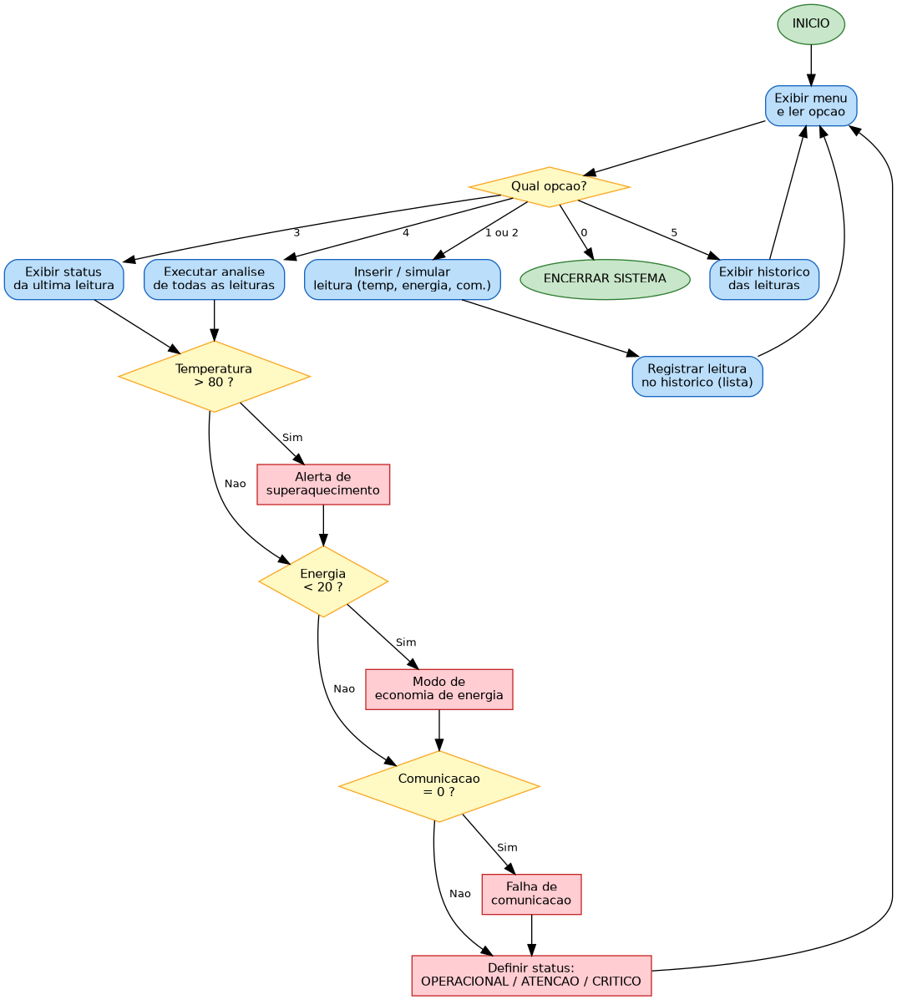

# 🛰️ Monitoramento de Missão Espacial

**FIAP · GS2026.1 · Data Structure and Algorithms**

Sistema interativo de terminal, em **Python**, que monitora os parâmetros de
uma missão espacial experimental (temperatura, energia e comunicação), emite
**alertas automáticos** e mantém um **histórico** das leituras usando estruturas
de dados.

## 👥 Integrantes

- Herbert Soares — RM: 571507
- Guilherme Garbelini — RM: 571150
- Gabriel de Almeida Santos — RM: 569395

## ▶️ Como executar

Não precisa instalar nada (Python puro):

```bash
python monitoramento_missao.py
```

O programa abre um **menu**:

```
1 - Inserir dados manualmente
2 - Simular leitura dos sensores
3 - Visualizar status atual
4 - Executar analise
5 - Historico das leituras
0 - Encerrar sistema
```

## 🧩 Explicação da lógica utilizada

**Estrutura de dados central.** Cada leitura dos sensores é guardada como um
dicionário (`id`, `temperatura`, `energia`, `comunicacao`) dentro de uma
**lista** chamada `historico`. Essa lista é o vetor principal do sistema: cresce
a cada nova leitura e é percorrida com **laços de repetição** para análise e
exibição.

**Entrada de dados.** Há duas formas (opções 1 e 2): o usuário pode digitar os
valores manualmente — com validação de intervalo via a função `ler_numero` — ou
deixar o sistema **simular** a leitura dos sensores gerando valores aleatórios.

**Verificação automática.** A função `analisar_leitura` aplica três regras com
**estruturas condicionais**:

| Condição | Alerta gerado |
|----------|---------------|
| Temperatura > 80 °C | Alerta de superaquecimento |
| Energia < 20% | Modo de economia de energia |
| Comunicação = 0 | Falha de comunicação |

**Status operacional.** O status de cada leitura é derivado da quantidade de
alertas: `0 alertas = OPERACIONAL`, `1 alerta = EM ATENÇÃO`,
`2 ou mais = CRÍTICO`. As cores no terminal (verde/amarelo/vermelho) reforçam
visualmente essa classificação.

**Funções.** O código é dividido em funções de responsabilidade única
(`inserir_dados_manual`, `simular_leitura`, `registrar_leitura`,
`analisar_leitura`, `exibir_leitura`, `visualizar_status`, `executar_analise`,
`exibir_historico`, `mostrar_menu`, `main`), o que mantém o programa organizado
e legível.

**Laço principal.** A função `main` roda um laço `while` que mantém o menu ativo
até o usuário escolher encerrar (opção 0).

## 📊 Fluxograma



## 🧰 Estruturas de dados e recursos usados

- **Lista** (`historico`) como vetor de leituras
- **Dicionários** para representar cada leitura
- **Condicionais** (`if/elif/else`) para alertas e menu
- **Laços** (`while` no menu, `for` na análise/histórico)
- **Funções** para modularizar a lógica
- **Cores ANSI** no terminal (recurso opcional)

## 🎥 Demonstração

[Assistir ao vídeo](https://youtu.be/U8iRIVjyWAI)
